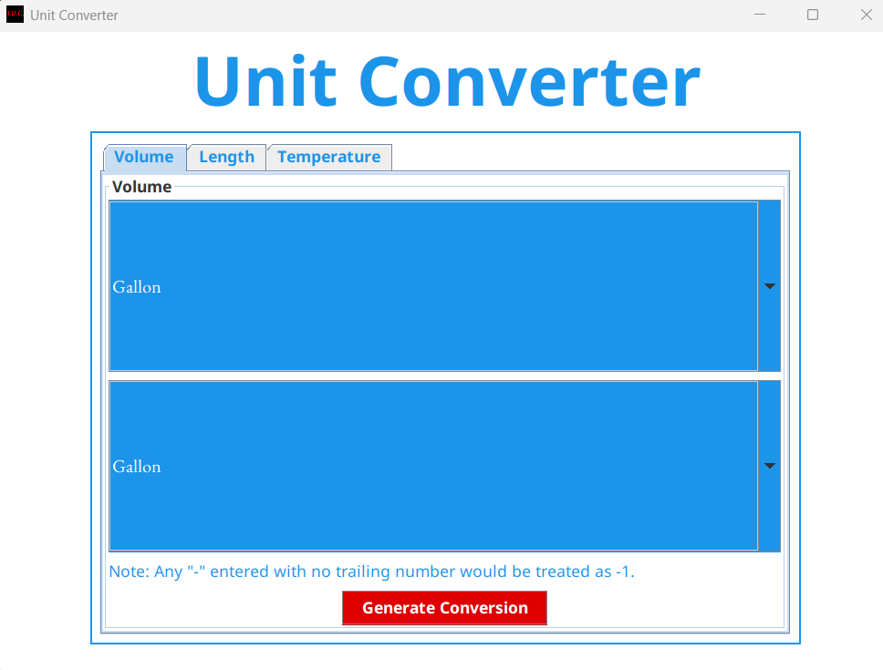
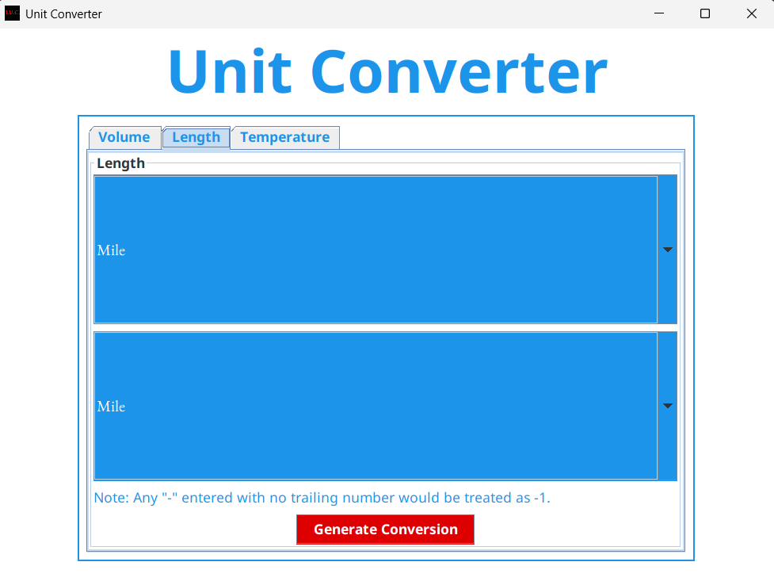
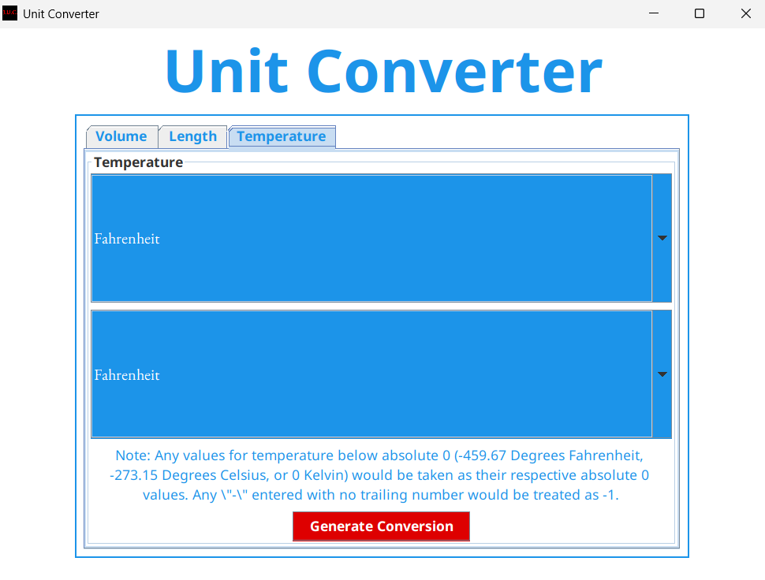
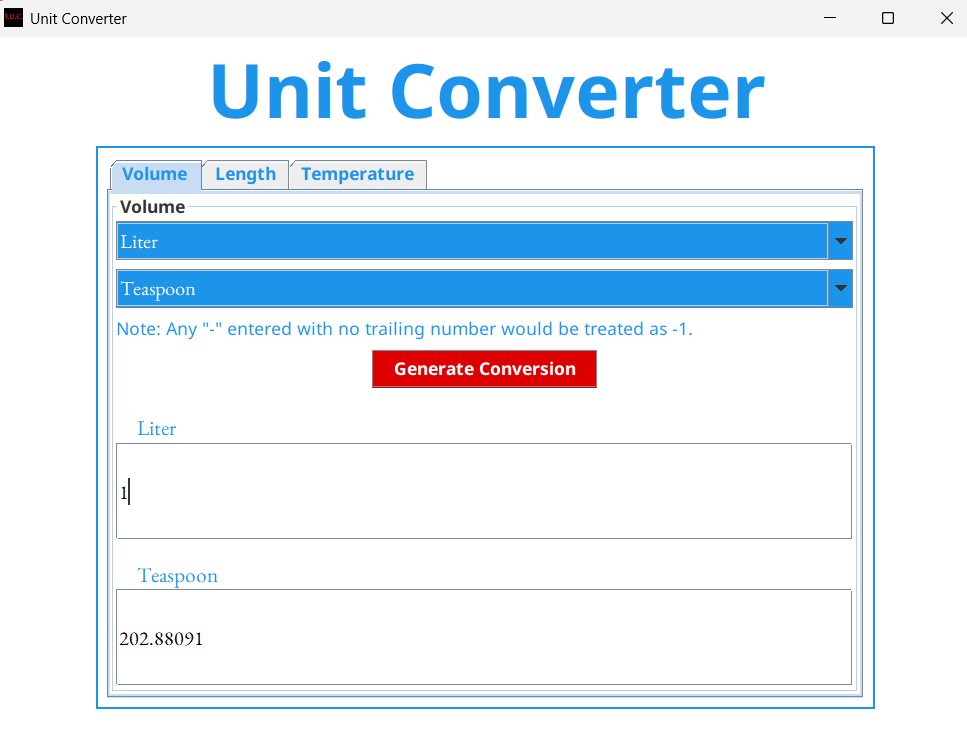
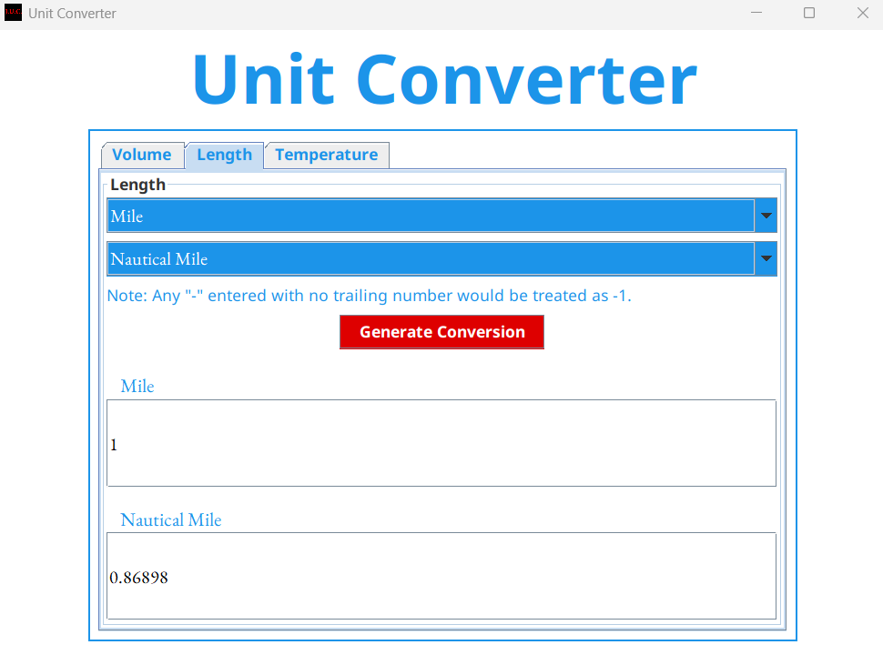
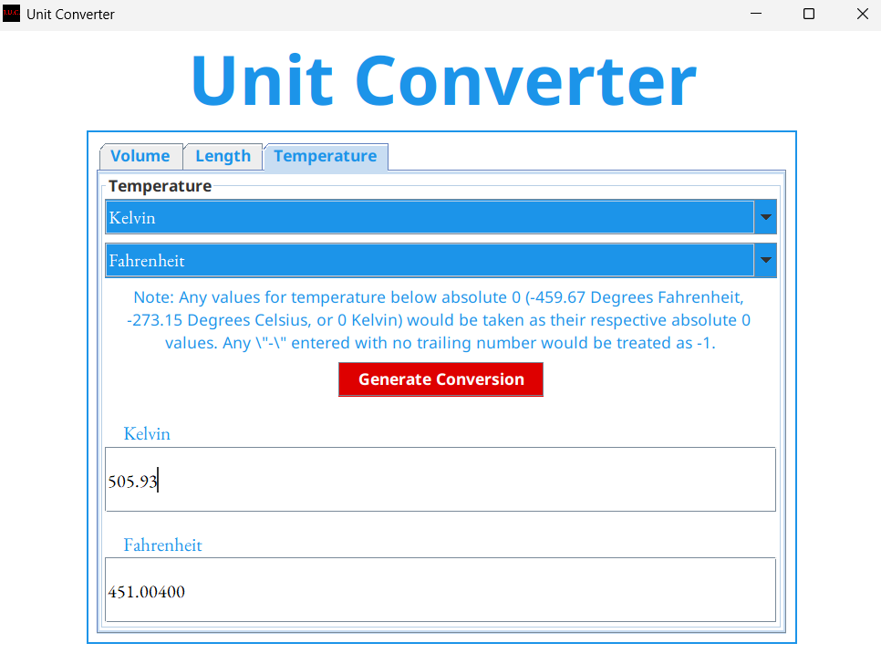

# Java Unit Converter
A Java Swing application for converting between volume, length, and temperature units with real-time calculations.
## Demo and Interface
* 
* 
* 
* 
* 
* 
## Features
### 1. Volume Conversion
Convert between 13 volume units:
* Gallons
* Cups
* Tablespoons
* Teaspoons
* Cubic Feet
* Cubic Yards
* Cubic Inches
* Liters
* Milliliters
* Cubic Meters
* Cubic Centimeters
* Quarts
* Pints
### 2. Length Conversion
Convert between 8 length units:
* Miles
* Yards
* Feet
* Inches
* Meters
* Kilometers
* Centimeters
* Nautical Miles
### 3. Temperature Conversion
Convert between 3 temperature units:
* Fahrenheit
* Celsius
* Kelvin
## Usage Instructions
1. **Select Conversion Type**
   * Choose between Volume, Length, or Temperature using the tabbed interface.
2. **Generate Conversion Box**
   1. Select source unit from the first dropdown.
   2. Select target unit from the second dropdown.
   3. Click **Generate Conversion**.
   * *Note:* You will get an error message if both units are identical.
3. **Real-time Conversion**
   * Enter value in either field.
   * Automatic conversion appears in the other field.
   * Supports decimal values and negative numbers (`-` by itself becomes `-1`).
## Installation & Running
1. **Requirements**
   * Java Development Kit (JDK) 8 or higher.
   * Project directory structure:
     ```
     Java-unit-converter/
     ├── App.java
     ├── fonts/
     │   ├── NotoSans-Regular.ttf
     │   ├── NotoSans-Bold.ttf
     │   └── EBGaramond-Regular.ttf
     └── font_licenses/
         ├── OFL-Noto_Sans.txt
         └── OFL-EB_Garamond.txt
     ```
2. **Compile and Run**
   ```bash
   javac *.java
   java App
   ```
3. **Troubleshooting**
   * **Fonts not loading?**
     * Verify the `fonts/` directory exists and filenames match those referenced in `App.java`.
     * Check file read permissions (especially on UNIX systems).
   * **Classpath errors?**
     ```bash
     javac -cp . *.java
     java -cp . App
     ```
   * **GUI looks odd?**
     * Ensure custom fonts loaded without errors.
     * Watch console for any error messages.
## Font Attribution
This application uses the following fonts under the [SIL Open Font License (OFL)](https://scripts.sil.org/OFL):
### EB Garamond
* **Author**: Georg Duffner
* **Source**: [https://github.com/octaviopardo/EBGaramond12](https://github.com/octaviopardo/EBGaramond12)
* **License**: [font_licenses/OFL-EB_Garamond.txt](font_licenses/OFL-EB_Garamond.txt)
### Noto Sans
* **Author**: Google Inc.
* **Source**: [https://github.com/notofonts/latin-greek-cyrillic](https://github.com/notofonts/latin-greek-cyrillic)
* **License**: [font_licenses/OFL-Noto_Sans.txt](font_licenses/OFL-Noto_Sans.txt)
## License Compliance
This project complies with the Apache License 2.0 and SIL OFL requirements by:
1. Including original font files without modification.
2. Bundling complete OFL license texts in `font_licenses/`.
3. Maintaining original copyright notices.
4. Not selling fonts independently of the application.
5. Providing clear attribution in documentation.
---
© 2025 richie-rich90454